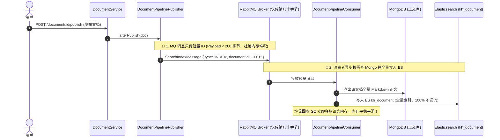

# 📝 全文检索架构设计与进阶优化备忘录（v4-fulltext-search）

> 本文档记录了系统在引入 **Elasticsearch 文档级全文检索（`kh_document`）** 过程中的核心架构设计、权衡痛点分析以及 **待落地的企业级优化方案（Claim Check 模式）**。

---

## 目录
- [一、 当前实现方案（快照直投模式）](#一-当前实现方案快照直投模式)
- [二、 核心痛点与风险分析](#二-核心痛点与风险分析)
  - [1. 痛点 A：正文截断导致长文深处内容搜不到（漏词风险）](#1-痛点-a正文截断导致长文深处内容搜不到漏词风险)
  - [2. 痛点 B：若不截断全塞入 MQ，容易导致 RabbitMQ 内存爆炸（OOM 风险）](#2-痛点-b若不截断全塞入-mq容易导致-rabbitmq-内存爆炸oom-风险)
- [三、 企业级待优化落地方案（Claim Check 模式）](#三-企业级待优化落地方案claim-check-模式)
  - [1. 架构流转时序图](#1-架构流转时序图)
  - [2. 改造对比表](#2-改造对比表)
- [四、 待优化实施步骤清单](#四-待优化实施步骤清单)

---

## 一、 当前实现方案（快照直投模式）

目前系统的实现逻辑如下：
1. **生产者（[`DocumentPipelinePublisher`](file:///Users/moliang/Desktop/coder/ai-rag-learning/src/mq/document-pipeline.publisher.ts)）**：
   * 发布文档时，截取 Markdown 正文的前 **1000 字符**（`contentPreview`），与元数据一同组装成快照放到 `SearchIndexMessage` 消息体中；
   * 发送到 RabbitMQ 交换机 `search.index.exchange`（路由键：`search.index.document`）。
2. **消费者（[`DocumentPipelineConsumer`](file:///Users/moliang/Desktop/coder/ai-rag-learning/src/mq/document-pipeline.consumer.ts)）**：
   * 收到消息后直接把消息体里的快照写入 Elasticsearch `kh_document`（零查库）。

---

## 二、 核心痛点与风险分析

```
            ┌─────────────────── 核心权衡冲突 ───────────────────┐
            │                                                    │
            ▼                                                    ▼
【风险 A：只截取前 1000 字符】                        【风险 B：若直接塞入全量大文本】
- 超过 1000 字处的关键词搜不到                      - 批量发布超大文档时，MQ 消息体过大
- 长篇白皮书/财报/合同发生漏召回                     - RabbitMQ 内存报警，Node.js 进程有 OOM 隐患
```

---

## 三、 企业级待优化落地方案（Claim Check 模式）

### 1. 架构流转时序图

通过 **“MQ 消息只传轻量 ID + 消费者从 Mongo 读取全量正文落库 ES”**，实现既不爆内存，又绝不漏词的最佳实践：



### 2. 改造对比表

| 维度 | 当前方案（1000 字符快照） | 优化后方案（Claim Check 模式） |
| :--- | :--- | :--- |
| **MQ 消息体积** | 几 KB ~ 几十 KB | **< 200 字节（极致轻量）** |
| **MQ 内存压力** | 批量导入时有一定压力 | **绝对零压力，杜绝 OOM** |
| **ES 全文搜索覆盖率** | ⚠️ 仅前 1000 字符（有漏词风险） | 🟢 **100% 全量正文检索，零死角召回** |
| **ES 高亮定位能力** | 只能高亮开头内容 | **支持整篇文档任何位置的精准高亮** |
| **架构一致性** | 与 RAG 模式不一致 | **与 RAG 管线风格 100% 保持一致** |

---

## 四、 待优化实施步骤清单

- [x] **步骤 1**：精简 `SearchIndexMessage`，移除冗余的 `document` 大快照，仅保留 `taskId`, `type`, `documentId`。
- [x] **步骤 2**：在 `DocumentPipelinePublisher.afterPublish` 中投递纯 ID 消息。
- [x] **步骤 3**：在 `PipelineOrchestrator.handleSearchIndex` 中，根据 `documentId` 从 Postgres 查元数据，从 Mongo 查全量 Markdown 正文，组装后写入 ES `kh_document`。
- [ ] **步骤 4**：编写 `SearchService` 与 `SearchController`，实现基于 ES 的多字段权重（`title^3` / `content^1`）、关键词高亮与分页接口。
